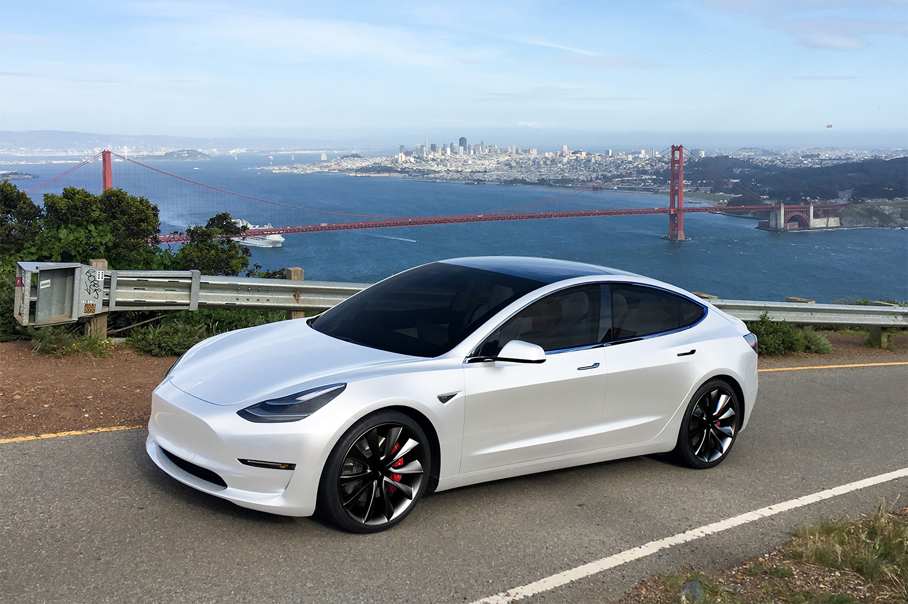
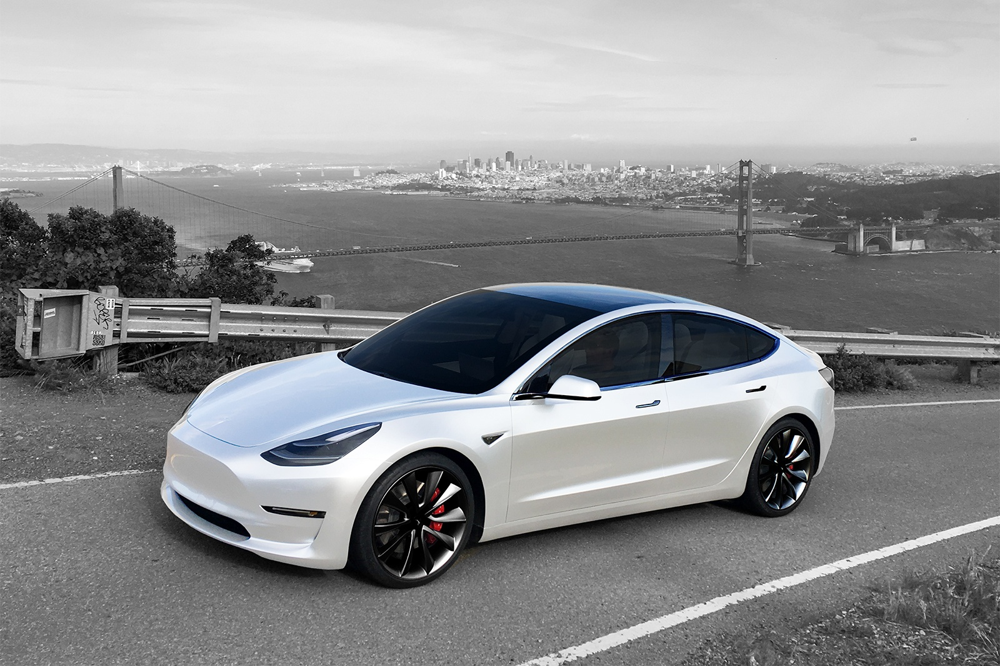
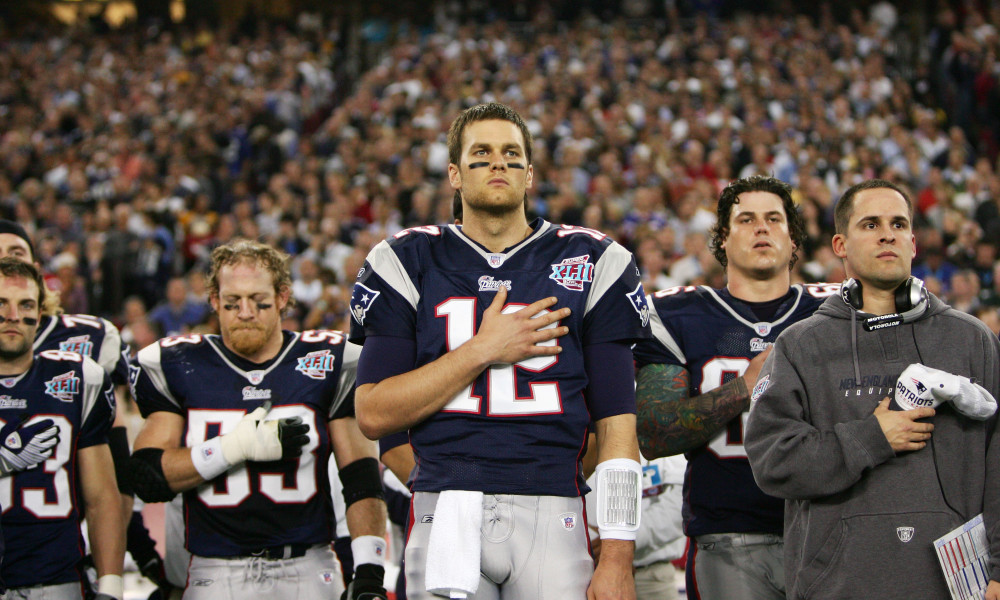
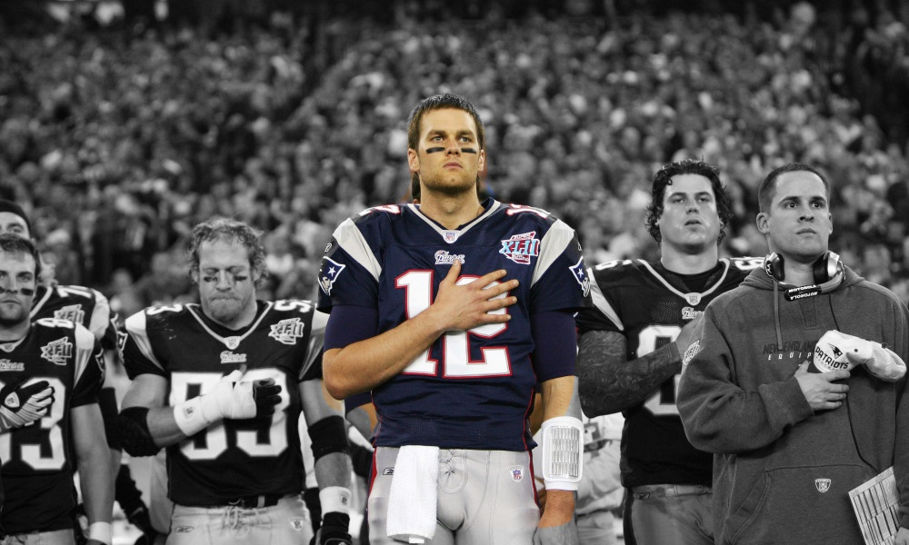

# Popbot
## Let AI transform your images

### Installation: (run both client & server simultaneously)
## client:
````bash
cd client

# Install dependencies
npm install

# Start dev server
npm run serve

````

## server:

**IMPORTANT:** Download the model file on [this link](https://github.com/matterport/Mask_RCNN/releases/download/v2.0/mask_rcnn_coco.h5) and put it in the server directory before doing the following.
````bash
cd popbot
pipenv shell

# Install dependencies (using Pipenv)
sudo pipenv install --skip-lock

# Start server with a category to detect
python main.py <category>

# Example:
python main.py person
````
### Categories:
You can start the server with one of these categories as arguments to detect them in your image.

1. **Vehicles:**
* car
* bicycle
* motorcycle
* airplane
* bus
* train
* truck
* boat

2. **Animals:**
* bird
* cat
* dog
* horse
* sheep
* cow
* elephant
* bear
* zebra
* giraffe

3. **Food:**
* banana
* apple
* orange
* carrot
* pizza
* cake
* cup
* bottle

4. **Other:**
* person
* umbrella
* skateboard
* laptop
* tv
* book

**NOTES:**
- For some weird reason, you have to restart the server in order to transform another image. If you don't, you'll get the first image as output. I didn't have time to figure out why that happens.
- You can't combine two categories.
- By default, only the largest object will be detected.

### Demo:

<p align="center">


</p>
<p align="center">


</p>


### Donate:

Yeah. I know, I don't really deserve a donation for this tiny thing but here are my crypto addresses in case you're Jesus or just in case you want to support a 19 years old nerd.

* **Bitcoin**: 1GUZ5w7A9PEu8TNrvKfAAaqhABUPW4RjfS

* **Ethereum**: 0x56D6C69EC22Ee78A0454A165738A20a2e961385d

* **Bitcoin Cash**: qz5mle4x2vjelax2c0wxhuprq5ha63w4xsj0r38g8s
